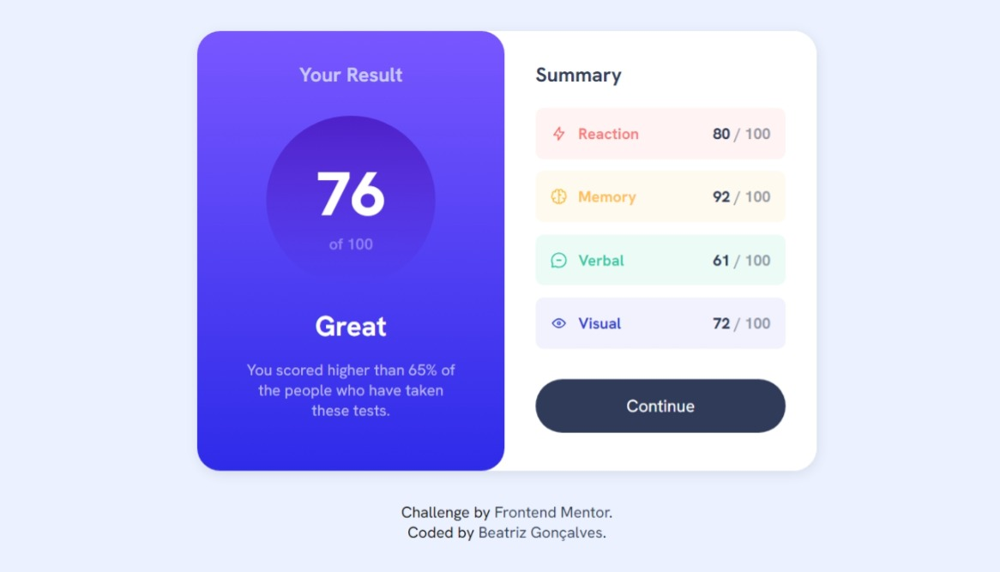
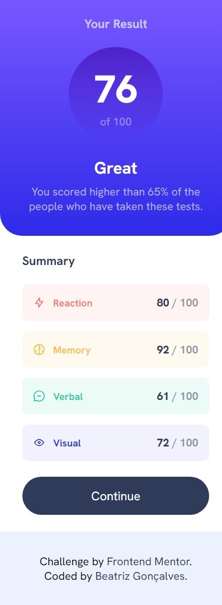

# Frontend Mentor - Results summary component solution

Essa é a solução para o [Results summary component challenge on Frontend Mentor](https://www.frontendmentor.io/challenges/results-summary-component-CE_K6s0maV). Os desafios do Frontend Mentor ajudam você a melhorar suas habilidades de codificação através da construção de projetos realistas.

## Tabela de conteúdos

- [Frontend Mentor - Results summary component solution](#frontend-mentor---results-summary-component-solution)
  - [Tabela de conteúdos](#tabela-de-conteúdos)
  - [Visão Geral](#visão-geral)
    - [O Desafio](#o-desafio)
    - [Screenshot](#screenshot)
    - [Links](#links)
  - [Meu processo](#meu-processo)
    - [Construído com](#construído-com)
    - [Desenvolvimento contínuo](#desenvolvimento-contínuo)
  - [Autora](#autora)

## Visão Geral

### O Desafio

Os usuários deverão ser capazes de:

- Ver o layout ideal para a interface dependendo do tamanho da tela do dispositivo
- Ver os estados de hover e focus de todos os elementos interativos na página

### Screenshot

### Links

- URL da solução: [Frontend Mentor](https://www.frontendmentor.io/solutions/results-summary-component-AWhP4_swNN)
- URL do site: [GitHub Pages](https://beatrizvsgoncalves.github.io/results-summary-component-main/)

## Meu processo

### Construído com

- HTML5 semântica
- Flexbox
- Mobile-first workflow

### Desenvolvimento contínuo

Este foi um bom desafio para treinar minhas habilidades com HTML e CSS. Tive algumas dificuldades, mas foram logo superadas ao rever meus projetos anteriores.

## Autora

- Github - [beatrizvsgoncalves](https://github.com/beatrizvsgoncalves)
- LinkedIn - [beatriz-vs-goncalves](https://www.linkedin.com/in/beatriz-vs-goncalves/)
- Frontend Mentor - [@beatrizvsgoncalves](https://www.frontendmentor.io/profile/beatrizvsgoncalves)